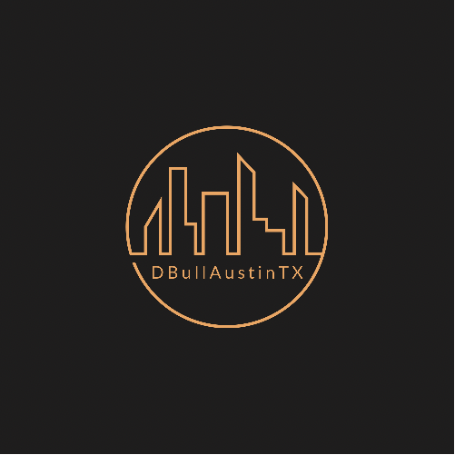

# dBull_ATX

<br>

<p style="align-contents: center;">

</p>

## Table of Contents

- [Description](#description)
- [Installation](#installation)
- [Purpose](#purpose)
- [Contributing](#contributing)
- [Issues](#issues)
- [Tests](#tests)
- [Dependencies_Used](#dependencies)

## Description

A portfolio to demonstrate previous projects

## Installation

For developers looking to develop something similar to this app, you must install [Node.js](https://nodejs.org/en/). Once you have Node.js installed, then install Node Package Manager(npm).

first...

```
npm init -y
```

then...

```
npm install create-react-app
```

Then follow your passion to build something special.

## Purpose

This portfolio was built to demonstrate the broad knowledge and determination of the author. I set out to add as many aspects needed to create a well rounded quality portfolio. Appreciate any constructive feedback so I can become a better developer.

## License


<br />
This application is not currently covered by any license, but was crafted with the open source community in mind.

## Contributing

With support and assistance from the developer community at large.

## Issues

There may be slight challenges with all functionality as of initial deployment

## Testing

[dBull_ATX Demo](https://determined-hypatia-94698c.netlify.app/)

## Dependencies

<p>


</p>
